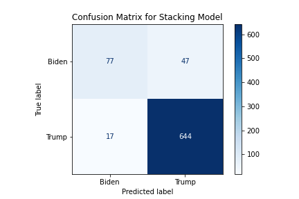

# Disparities in COVID Vaccination Across the American Political Divide

### A data science investigation by Ankita Patil, Jacqueline Simeone, Andy Orfalea, and Annie Bishai

---

# Introduction

The COVID-19 pandemic emerged at a time of intense political division in the United States. The election of Donald Trump, a [denier](https://www.theatlantic.com/politics/archive/2016/12/donald-trump-climate-change-skeptic-denial/510359/) of scientific fact, in 2016 was a symptom of deep social, ideological, and informational divides and a herald of intensifying polarization on all of these axes. When voters had the choice of re-electing Trump or electing Joe Biden, the Delta wave of the virus had just peaked. Election Day 2020 was concurrent with the national COVID [death tally](https://covidtracking.com/data/national/deaths) officially surpassing 225,000. Election disinformation, much of it perpetuated by the Trump administration, was a [major issue](https://misinforeview.hks.harvard.edu/article/covid-19-misinformation-and-the-2020-u-s-presidential-election/) in the election, according to experts. Although the Biden administration has taken a drastically different approach to public information and policy, vaccination acceptance as well as COVID death rates continue to be stratified [along political lines](https://www.nytimes.com/2021/09/27/briefing/covid-red-states-vaccinations.html).

Even the reddest states have blue counties, and vice versa, and the COVID pandemic has highlighted that these local divides manifest in a consequential way. Maps readily [accessible](https://www.nytimes.com/interactive/2021/us/covid-cases.html?name=styln-coronavirus&region=TOP_BANNER&block=storyline_menu_recirc&action=click&pgtype=Interactive&variant=0_Control&is_new=false) from media outlets reveal local disparities in COVID incidence, vaccination, and other measures. Moreover, policy pertaining to COVID is often determined on municipal and county levels, and the proliferation of [protests](https://bethesdamagazine.com/bethesda-beat/schools/hundreds-of-mcps-students-walk-out-in-protest-of-districts-handling-of-covid-19/) [against various](https://spectrumlocalnews.com/nys/buffalo/news/2021/12/01/group-plans-covid-19-mandate-protest) [COVID](https://www.latimes.com/california/story/2021-11-29/la-me-california-covid-mandates-constitutional-republic) [policies](https://www.kcra.com/article/stanislaus-county-students-parents-protest-covid-19-vaccine-mandate/37888350#) in recent months reveals that on the most local levels Americans are of diverse mindsets. The goal of this project is to explore social and political divides on a more granular level than the red state/blue state binary, using additional social and demographic variables to illuminate, and examine the strength of, these divides.

# Exploratory Data Analysis

Initial visualizations of the vaccine-related and political data reveals substantial differences in vaccination rates and hesitancy rates between Trump counties and Biden counties. 

For example, while early vaccination rates (in March 2020 -- when the vaccine was mostly available to people over 65 and those with underlying conditions) were similar, the rate of first vaccination administration in Trump counties lagged far behind those seen in Biden counties by March 2022:

  
   

EDA also revealed higher rates of vaccine hesitancy in Trump-supporting counties and in rural counties:

  

# Hypothesis

Based on our exploration of the data, we hypothesize that fitting a KMeans clustering model to our vaccine- and vaccine hesitancy-related data will reveal stratification within states along similar lines to those seen in the 2020 presidential election. We predict that with the inclusion of demographic and socioeconomic data not directly related to COVID, this model will generally continue to reflect those patterns. This hypothesis is informed by the fact of missing data, which may limit the model's ability to discern other meaningful differences among counties.

Because of the close vaccine/election relationships in these data we have observed--and hope to observe further through our clustering model--we additionally predict that applying a supervised machine learning model to the same data may yield an accurate prediction of the voting tendencies of a county. We will explore this by training the model with a target variable drawn from the 2020 presidential election results.

# Models

## KMeans Clustering

The KMeans model fit the data best with three clusters:

The features used in the model, and the mean of each feature by cluster (i.e. the centroid locations), are displayed here:

| Cluster | Green | Yellow | Red |
|---------|---|---|---|
| Pct_Hesitant_Feb22 | 0.293 | 0.176 | 0.252 |
| Pct_Somewhat_Hesitant_Feb22 | 0.083 | 0.050 | 0.074 |
| Pct_Highly_Hesitant_Feb22 | 0.210 | 0.126 | 0.178 |
| Dose1_Pop_Pct_030121 | 13.699 | 15.968 | 2.108 |
| Dose1_Pop_Pct_090121_impute | 39.939 | 56.148 | 19.306 |
| Dose1_Pop_Pct_030122 | 50.963 | 70.741 | 43.620 |
| Series_Complete_Pop_Pct_090121_impute | 34.221 | 50.031 | 21.085 |
| Series_Complete_Pop_Pct_030122 | 4.706 | 62.176 | 41.196 |
| Booster_Doses_Vax_Pct_030122 | 41.326 | 46.515 | 34.677 |
| Missing_Sept21 | 0.002 | 0.037 | 0.619 |
| SVI_Overall | 0.583 | 0.459 | 0.586
| Metro_Status | 0.215 | 0.599 | 0.329
| Census2019_Pct_65Plus | 0.202 | 0.191 | 0.197 |

**Summary of observations from clustering model:**

*Green Cluster*

- These counties have the highest vaccine hesitancy, but their vaccination rates are in the middle of the pack. This could be due to the red cluster's vaccination averages being brought down by non-reporting.
- These counties are generally rural (metro status=0); their social vulnerability is high as measured by socioeconomic status and about the same overall as the red cluster's.
- Trump won the election in 94.8% of these counties, the highest percent among all the clusters.
- Overall this cluster appears demographically and politically similar to Cluster 2.

*Yellow Cluster*

- These counties have the lowest hesitancy and highest vaccination rates overall.
- These counties are most urban (metro status=1) on average and comprise the largest total population (about 5x the population of the green cluster and 8x the population of the red cluster).
- These counties have the lowest social vulnerability rankings overall and by socioeconomic status, but they contain more minority population than the green cluster.
- These counties had the lowest rates of voting for Trump, with Trump victory occurring in 64% of counties compared to 83% nationwide.

*Red Cluster*

- Most counties that did not report vaccination data are in this cluster. Nearly half of these counties are in Texas.
- Possibly due to non-reporting, these counties' vaccination rates are the lowest. The hesitancy rates (17.8% on average are highly hesitant), however, support the hypothesis that vaccination efforts have in fact faced barriers in these counties.
- These counties have the highest social based on minority status, but comparable overall social vulnerability to the green cluster.
- These counties had an above-average rate of Trump election victory, but not as high a rate as the green cluster.

A map showing percentage of votes for **Trump (red)** and **Biden (blue)** reveals that counties in the yellow cluster -- which had the highest vaccination rates -- tended to vote for Biden:

## Classification Model

To further investigate the relationship between the COVID vaccine and politics, and because the KMeans clustering model produced clusters with distinct differences in voting patterns without using this as a feature, we wanted to see if we could predict 2020 county election results using COVID vaccine data. In predicting this, our model used COVID vaccine statistics as well as two county demographic metrics we felt were very relevant to COVID-- "Percent of Population over 65 years old" and "SVI Category".

Because Trump won 83% of all counties, the baseline model would be 83% accurate and that’s what we set out to beat.  After trying multiple models, we landed on a Stacking model that ensembled predictions from four different classifying models (K-Nearest Neighbors, Random Forest, Bagging, and Ridge). The Stacking model took predictions from all of those models, and used Logistic Regression to make its ultimate predictions. We ended up with an overall **accuracy of 91.4%**, and a recall score (true positive rate) of **97.1%**, meaning that the model was highly accurate among actual Trump-voting counties. False positives (inaccurate predictions of Trump victory) occurred frequently than false negatives (inaccurate predictions of Biden victory), so the model's precision was lower, at 93%. The f1 score was 95.0%. 

  

# Conclusions

Our KMeans clustering model was partially successful in lending insight to the relationships among demographic, social vulnerability, and vaccine-related factors in the United States, and the relationship of these factors to election outcomes in 2020. We selected features for which the data was best modeled in three clusters, which necessarily lent insight into patterns of stratification with more detail than the red-state/blue-state divide. The three clusters that the model found did show marked differences in their 2020 election outcomes, supporting this portion of our hypothesis. 

However, as we foresaw, the clustering model suffered from missing data bearing a conceivable relationship (causal or not) to politics. Interestingly, counties that did not report data at one or more points in time were grouped into a single cluster (Cluster 2) which was otherwise relatively similar to another (Cluster 0). It is likely that this model is overfitted to this particular moment in time, and that the information from our clusters should not be the basis for generalization.

The stacked classification model successfully predicted 2020 election results with a higher degree of accuracy than the baseline using vaccination-related variables. This further supports our hypothesis that these variables are closely related. However, the fact that the vaccination data contained many missing values and that these values were represented as zeroes suggests that caution should be taken in interpreting specific numeric relationships regarding vaccine-related observations.

The outcomes of both modeling exercises generally reinforce what has been observed about politics and COVID vaccination, and they allow some insight into specific trends and variable relationships as seen in the notebooks and slides contained in this repo. In addition to potential usefulness of this investigation to public health officials and government at the state and federal levels, the project is also of use to the general public, as a snapshot of where we were and where we are, and the extent to which the politics of two years ago are still largely replicated in our pandemic response.

**Please see the wiki for further documentation on sources. Thank you for visiting!**